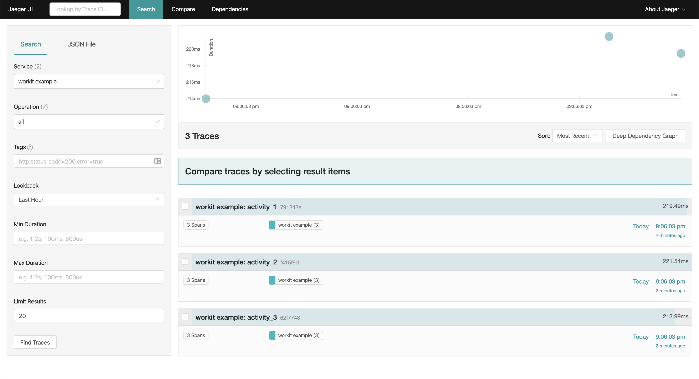
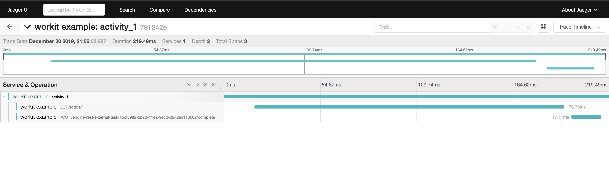
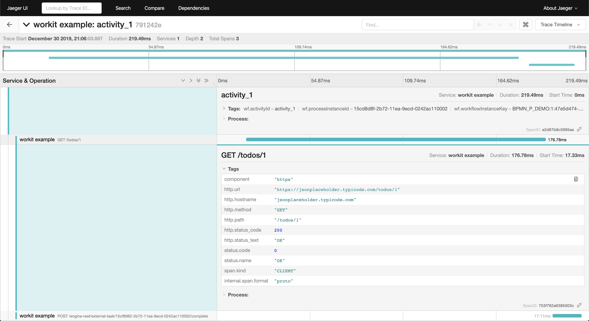

# Overview

This example shows how to use [Workit](https://villedemontreal.github.io/workit/) to create a simple Node.js application - e.g. a worker that executes a simple task. You will learn how to instrument your application and get traces.

Have fun!

## Installation

First, start Jaeger with docker

```bash
docker run -d --name jaeger \
  -e COLLECTOR_ZIPKIN_HTTP_PORT=9411 \
  -p 5775:5775/udp \
  -p 6831:6831/udp \
  -p 6832:6832/udp \
  -p 5778:5778 \
  -p 16686:16686 \
  -p 14268:14268 \
  -p 9411:9411 \
  jaegertracing/all-in-one:latest
```

Be sure to have a Camunda platform running. Let's say, you have Camunda BPM (default):
```bash
docker run -d --name camunda -p 8080:8080 camunda/camunda-bpm-platform:latest
```

Then, with your terminal, go to `examples/opentelemetry` run:
```bash
npm i && npm run build
```
and in order to deploy your bpmn and create a process instance in Camunda, run:
```bash
npm run deploy && npm run create-instance
```
Finally, run the worker by running the following command:
```bash
npm run worker
```

You can then navigate to `http://localhost:16686` to access the Jaeger UI.
You should see something like:

<p align="center">
  <a href="../../getting-started/jaeger/jaeger-home.png"></a>
</p>

By clicking on a trace, you should see something like:
<p align="center">
  <a href="../../getting-started/jaeger/jaeger-trace.png"></a>
</p>

<p align="center">
  <a href="../../getting-started/jaeger/jaeger-span.png"></a>
</p>

👏 Congrats, you have finished the tracing section!

### FAQ

#### error sending spans over UDP: Error: send EMSGSIZE [...]

related issue: https://github.com/jaegertracing/jaeger-client-node/issues/124
In your terminal, you can do something like:

```bash
% sysctl net.inet.udp.maxdgram
net.inet.udp.maxdgram: 9216
% sudo sysctl net.inet.udp.maxdgram=65536
net.inet.udp.maxdgram: 9216 -> 65536
% sysctl net.inet.udp.maxdgram
net.inet.udp.maxdgram: 65536
```

## Useful links
- For more information on OpenTelemetry, visit: <https://opentelemetry.io/>
- For more information on workit, visit: <https://villedemontreal.github.io/workit/>

## LICENSE

MIT
