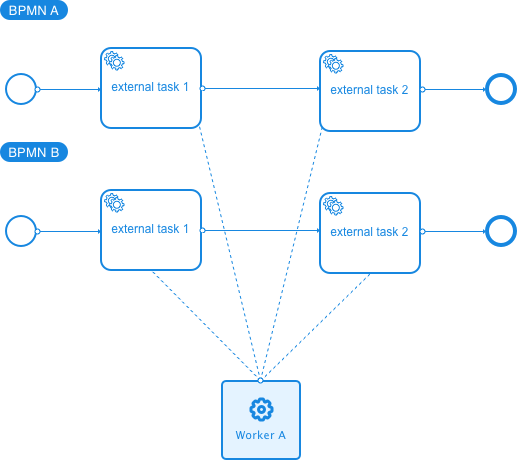

# Getting started

## Camunda BPM
Make sure to have Camunda running at http://localhost:8080

Run in your terminal in the root folder:

```bash
npm run camunda:deploy
```
Now, You should have a `Demo` process definition visible here: http://localhost:8080/camunda/app/cockpit/default/#/processes

```bash
npm run camunda:create-instance
```
Now, in your `Demo` process definition, you should see the bpmn with 5 instances attached to `Activity`.

```bash
npm run camunda:worker
```
You should see in the console, all activities crushed by the worker. Now, if you look back to the `Demo` Bpmn (refresh the page), you see that the instances have disappeared.

👏 Congrats, you have finished the getting started section!

## Zeebe

TODO

# How to use

Make sure to have Camunda running.
Create a simple process model with an External Service Task and define the topic as 'topicName' (or type for Zeebe).
Deploy the process to the Camunda BPM engine or Zeebe.

In your NodeJS script:

```ts
import { SERVICE_IDENTIFIER as CORE_IDENTIFIER, IoC, ICamundaConfig, Worker } from 'workit-camunda';

// In helloWorldTask.ts file
class HelloWorldTask extends TaskBase<IMessage> {
    public execute(message: IMessage): Promise<IMessage> {
        console.log('Servus!');
        // put your logic in here
        return Promise.resolve(message);
    }
}

// In config file

// configuration for the Client:
//  - 'baseUrl': url to the Workflow Engine
//  - 'maxTasks': maximum task to take
//  - 'workerId': name of your worker
//  - 'topicName': topic to subscribe
//  ... there is more options you can add
const config: ICamundaConfig = {
    maxTasks: 1,
    workerId: 'demo',
    baseUrl: `https://localhost:8080/engine-rest`,
    topicName: 'topic_demo'
};

IoC.bindTo(HelloWorldTask, '<ACTIVITY_ID_FROM_BPMN>');
IoC.bindToObject(config, SERVICE_IDENTIFIER.camunda_external_config);

// In app.ts file
const worker = IoC.get<Worker>(SERVICE_IDENTIFIER.worker);
worker.start();
worker.run();

```

Some events are available to you : `starting`, `stopping`, `stopped`, `message`, `message-handled`.
- `message` event have `ICamundaTask` arguments. It occurs when the worker receive a message.
- `message-handled` event have some arguments (error: Error, message: `IMessage`). In case of sucess, error will be null. It occurs when the message has been resolved (success or failure).

In `Camunda`, each external task has an ID. You need to use `IoC` in order to bind the task that extends `TaskBase<I>` to the external task id.

For example, I have an external task `myTask` (id) in my bpmn file :

```javascript
export class MyTask extends TaskBase<IMessage> {

  constructor() {
    super();
  }
  public async execute(message: IMessage): Promise<IMessage> {
    // put your logic here
    return message;
  }
}

export const myTask = new MyTask();

```
After creating this new task, we need to bind it by using `IoC`.

In my "config/ioc.ts" file :

```ts
IoC.bindToObject(myTask, 'myTask');
```
Now, the worker knows what to resolve when this external task will be executed through Camunda.

### Extends the Core Camunda worker library

Since we use IoC for binding classes, you are able to :
  - Tell Camunda that the execution is a success
  - Tell Camunda that the execution is a failure
  - Pass logger (notice that in standard env we replace default logger by another for reducing noise and safety)
  - Pass interceptors. For example, give Oauth info to Camunda, if needed.
  - ...

By default, we have implemented :
  - `FailureStrategySimple` (not for production use) but you can provide your own by implementing `IFailureStrategy`
  - `SuccessStrategySimple` but you can provide your own by implementing `ISuccessStrategy`

## Worker topology

- You can specify workflows and versions in order to bind a task for a specific workflow version. 
- You can also bind a default task (without workflow)

### One to govern them all

<p align="center">
  <a href="./worker-topology-1/Group@3x.pn"></a>
</p>

### Isolation

<p align="center">
  <a href="./worker-topology-2/Group@3x.pn"></a>
</p>

### Microservices

<p align="center">
  <a href="./worker-topology-3/Group@3x.pn"></a>
</p>